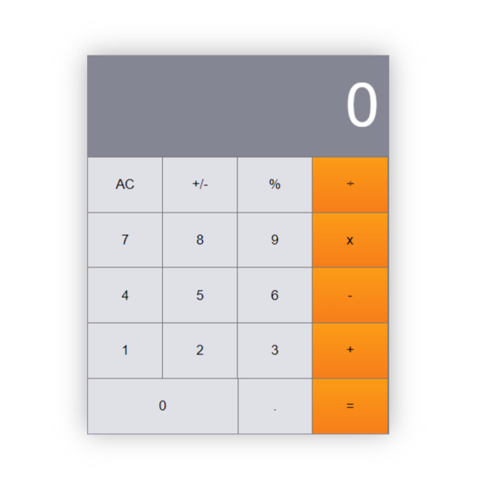

# Math Magicians application


"Math magicians" is a website for all fans of mathematics. It is a Single Page App (SPA) that allows users to make simple calculations and read a random math-related quote.



## Built With

- HTML
- CSS
- JavaScript
- Webpack

## Live Demo 

[Live Demo Link](https://math-magician-calculator.netlify.app)


## Getting Started


To get a local copy up and running follow these simple example steps.


- clone the repository by running
``` git clone https://github.com/Tobinchilongo/Math-Magic.git ```
- navigate to the folder
``` cd Math-Magic ```
- Install packages
``` npm install ```
- Run the app
``` npm start ```

## Prerequisites
- Linters
- GitHub Flow
- Javascript
- WEBPACK

### Run tests
Run the test 
`npm run test`

## Authors

👤 **Author 1: Tobin Chilongo Jnr**
 

- GitHub: [@Tobinchilongo](https://github.com/Tobinchilongo)
- Twitter: [@Tobin_Official](https://twitter.com/Tobin_Official)
- LinkedIn: [@Tobin Chilongo](https://www.linkedin.com/in/tobin-chilongo-a6736415a/)


## 🤝 Contributing

Contributions, issues, and feature requests are welcome!

Feel free to check the [issues page](../../issues/).

## Show your support

Give a ⭐️ if you like this project!


## 📝 License

This project is [MIT](./MIT.md) licensed.
